<!-- ============================== HEADER ============================== -->

  

  

  
  
  
  
  

  
  
  

---

## #about-me

I'm a Computer Science & Engineering undergraduate at **Khulna University of Engineering & Technology (KUET)**, 4x **Hackathon** Winner and the founder of **[Logarithm Studio](https://www.logarithmstudio.com/)**.

---

## #skills

<table>
  <tr>
    <td align="right" width="170"><b>Languages</b></td>
    <td></td>
  </tr>
  <tr>
    <td align="right"><b>Frontend & Backend</b></td>
    <td></td>
  </tr>
  <tr>
    <td align="right"><b>DevOps & Infra</b></td>
    <td></td>
  </tr>
  <tr>
    <td align="right"><b>Databases & Caching</b></td>
    <td>
      
      &nbsp;
    </td>
  </tr>
  <tr>
    <td align="right"><b>Machine Learning</b></td>
    <td></td>
  </tr>
  <tr>
    <td align="right"><b>Hardware</b></td>
    <td></td>
  </tr>
</table>

---

## #achievements

| | Result | Event | Track |
|:-:|:--|:--|:--|
| 🏆 | **Champion** | JRA Foundation July Hackathon 2026 | Crisis Tech |
| 🏆 | **Champion** | Build with Gemma Hybrid Hackathon — sponsored by Google | Hybrid Hackathon |
| 🥉 | **2nd Runner-up** | BUET CSE Fest 2026 Hackathon | Microservices & DevOps |
| 🥉 | **2nd Runner-up** | IUT Techathon Nationals & Rover Summit 2026 | Hackathon Segment |
| 🥉 | **2nd Runner-up** | KUET HACK | Project Showcasing |
| ⭐ | **Pupil** | Codeforces | Competitive Programming |
| 🎓 | **Dean's List eligible** | KUET | 2nd & 3rd Year |

---

## #github-stats

  

  

  <picture>
    <source media="(prefers-color-scheme: dark)" srcset="https://raw.githubusercontent.com/ripWr3ncH/ripWr3ncH/output/snake-dark.svg?v=3" />
    <source media="(prefers-color-scheme: light)" srcset="https://raw.githubusercontent.com/ripWr3ncH/ripWr3ncH/output/snake.svg?v=3" />
    
  </picture>

<!-- ============================== FOOTER ============================== -->

  

